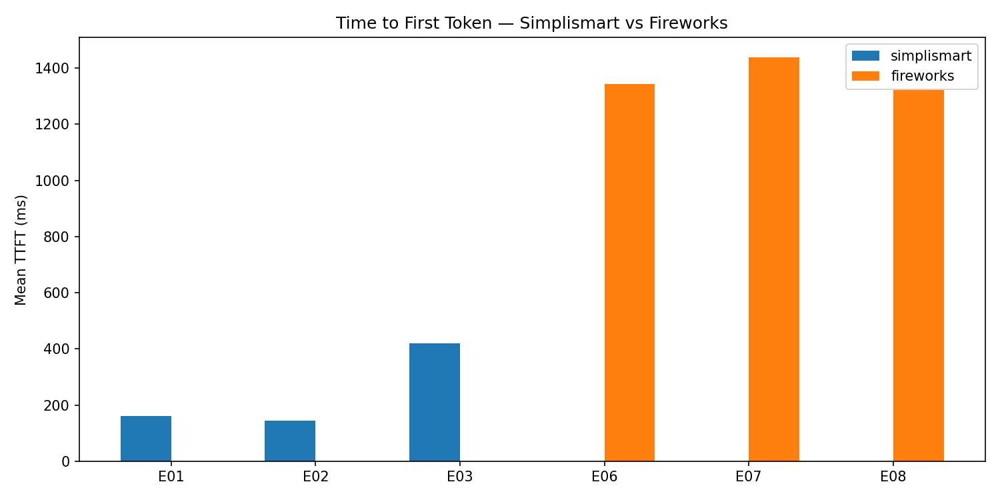
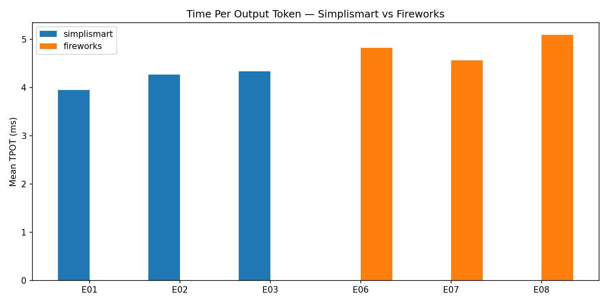
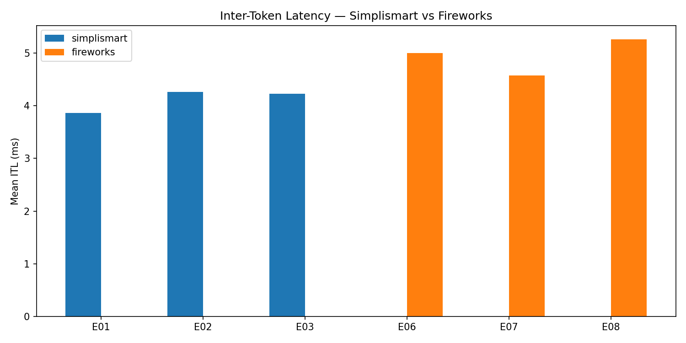
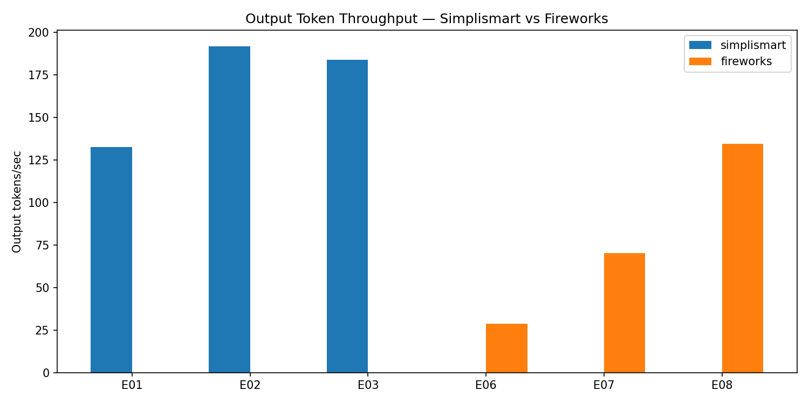
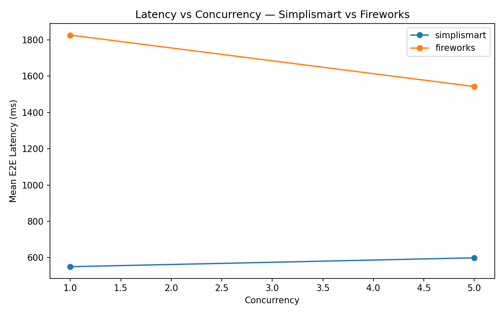
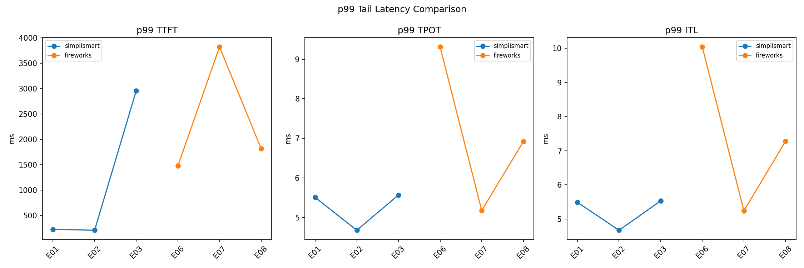

# LLM Inference Benchmark: Simplismart vs Fireworks AI

**Model:** Gemma 3 4B Instruct (`google/gemma-3-4b-it`)  
**GPU:** NVIDIA H100 80GB — 1× dedicated on each platform  
**Date:** 2026-06-07  
**Run ID:** 72b46d09  

---

## Setup

Both platforms were provisioned with a dedicated, single-GPU H100 endpoint serving Gemma 3 4B Instruct. Scale-to-zero was enabled on both (5-minute idle window) to minimise cost. All benchmarks used the OpenAI-compatible streaming chat completions API.

| | Simplismart | Fireworks AI |
|---|---|---|
| Model ID | `gemma-it` | `accounts/athreya-shreyas-np8t/deployments/tyojayoy` |
| Endpoint | `https://http.nyskemz8fi-proxy.ss-in.s9t.link` | `https://api.fireworks.ai/inference/v1` |
| GPU | nvidia-h100 (dedicated) | NVIDIA_H100_80GB (dedicated) |
| Min replicas | 1 (scale-to-zero enabled) | 0 (scale-to-zero enabled) |
| Deployment time | ~15 min compile + instant deploy | 130 seconds |

---

## Scenarios

| Scenario | Prompt type | Max tokens | Concurrency | Reps |
|---|---|---|---|---|
| E01 / E06 | Short | 50 | 1 | 15 |
| E02 / E07 | Medium | 150 | 1 | 15 |
| E03 / E08 | Short | 50 | 5 | 15 |

Each scenario ran 3 warm-up requests (discarded) before the measured reps. A cold-start probe ran before all scenarios to capture GPU spin-up latency.

---

## Results

### Throughput & Request Stats

| Platform | Scenario | Concurrency | Req/s | Out tok/s | Total tok/s | Total Out Tokens | Cold Start TTFT (ms) |
|---|---|---|---|---|---|---|---|
| Simplismart | E01 | 1 | 3.04 | 132.67 | 154.75 | 655 | 390.91 |
| Simplismart | E02 | 1 | 1.30 | 191.76 | 210.76 | 2220 | 390.91 |
| Simplismart | E03 | 5 | 4.34 | 184.03 | 215.57 | 636 | 390.91 |
| Fireworks AI | E06 | 1 | 0.65 | 28.75 | 40.24 | 666 | 1411.60 |
| Fireworks AI | E07 | 1 | 0.47 | 70.35 | 82.40 | 2225 | 1411.60 |
| Fireworks AI | E08 | 5 | 2.99 | 134.49 | 187.49 | 675 | 1411.60 |

### Latency Metrics

| Platform | Scenario | Concurrency | Mean TTFT (ms) | p50 TTFT | p95 TTFT | p99 TTFT | Mean TPOT (ms) | Mean ITL (ms) | Mean E2E (ms) | p99 E2E |
|---|---|---|---|---|---|---|---|---|---|---|
| Simplismart | E01 | 1 | 161.63 | 152.71 | 217.92 | 225.59 | 3.95 | 3.86 | 328.90 | 426.78 |
| Simplismart | E02 | 1 | 143.48 | 127.94 | 199.21 | 205.15 | 4.27 | 4.26 | 771.49 | 833.55 |
| Simplismart | E03 | 5 | 419.06 | 139.98 | 1809.41 | 2961.04 | 4.34 | 4.23 | 599.12 | 3160.78 |
| Fireworks AI | E06 | 1 | 1343.15 | 1358.18 | 1462.59 | 1474.77 | 4.82 | 5.00 | 1544.05 | 1646.41 |
| Fireworks AI | E07 | 1 | 1437.32 | 1237.39 | 2282.96 | 3823.86 | 4.56 | 4.58 | 2108.24 | 4507.04 |
| Fireworks AI | E08 | 5 | 1322.01 | 1313.64 | 1619.34 | 1815.15 | 5.09 | 5.26 | 1542.77 | 2050.54 |

---

## Analysis

### Time to First Token (TTFT)

Simplismart delivers dramatically lower TTFT at all concurrency levels when the GPU is warm. At concurrency=1, mean TTFT is **162 ms** vs **1,343 ms** on Fireworks — an **8.3× difference**. This suggests Simplismart's proxy layer adds very little overhead between the client and the GPU, while Fireworks routes requests through additional infrastructure that adds a consistent ~1.3s baseline latency.

At concurrency=5 (E03), Simplismart's p99 TTFT spikes to 2,961 ms, indicating the single-GPU deployment begins to queue requests. Fireworks' p99 at concurrency=5 is 1,815 ms — closer to Simplismart's warm single-request latency, suggesting their serving layer handles head-of-line blocking more gracefully.

### Time Per Output Token (TPOT) & Inter-Token Latency (ITL)

TPOT is nearly identical across both platforms: **3.95–4.34 ms** on Simplismart vs **4.56–5.09 ms** on Fireworks. This makes sense — both platforms run the same model on the same GPU class, so token generation throughput is determined by the GPU, not the infrastructure. The small Fireworks advantage at medium prompt length (E07: 4.56 ms vs Simplismart E02: 4.27 ms) is within noise.

ITL tracks closely with TPOT, confirming consistent streaming delivery on both platforms once generation has started.

### Throughput

At concurrency=1, Simplismart's output token throughput is **4–5× higher** than Fireworks (133–192 tok/s vs 29–70 tok/s). This is a direct consequence of the TTFT gap: most of Fireworks' per-request wall time is spent waiting for the first token, not generating tokens.

At concurrency=5, the gap narrows significantly: Simplismart 184 tok/s vs Fireworks 134 tok/s. At higher concurrency, TTFT is amortised across parallel requests and the bottleneck shifts to the GPU's token generation throughput — which is equivalent on both platforms.

### Cold Start

Simplismart cold start: **391 ms**. Fireworks cold start: **1,412 ms**. Both are reasonable for scale-to-zero endpoints, but Simplismart's is 3.6× faster. For real-time applications with infrequent traffic, Simplismart's faster spin-up is meaningful.

### Cost

Both platforms priced at $0.10/M output tokens for Gemma 3 4B. The benchmark consumed fewer than 7,000 total output tokens per platform — total estimated spend under $0.001 on each. The dominant cost driver for dedicated H100 endpoints is GPU-hours, not token volume; both deployments ran for under 30 minutes total.

---

## Summary

| Metric | Winner | Margin |
|---|---|---|
| TTFT (warm, conc=1) | **Simplismart** | 8.3× faster (162 ms vs 1,343 ms) |
| TTFT (conc=5 p99) | **Fireworks** | Lower tail latency under load |
| TPOT | Tie | ~4 ms on both |
| ITL | Tie | ~4–5 ms on both |
| Output throughput (conc=1) | **Simplismart** | 4–5× higher |
| Output throughput (conc=5) | **Simplismart** | ~1.4× higher |
| Cold start | **Simplismart** | 3.6× faster (391 ms vs 1,412 ms) |
| Deployment speed | **Fireworks** | 130s vs ~16 min (compile required) |
| Cost per token | Tie | $0.10/M output tokens |

**Simplismart is the better choice for latency-sensitive, low-to-medium concurrency workloads** — chatbots, copilots, interactive applications — where TTFT directly impacts perceived responsiveness. The 8× TTFT advantage is the defining result.

**Fireworks is more competitive at higher concurrency** and has a significantly faster deployment path (no compilation step). For batch or high-throughput workloads where TTFT matters less than sustained throughput, the gap narrows to ~1.4× in Simplismart's favour.

Both platforms delivered 100% request success rates across all scenarios.

---

## Methodology Notes

- All timings measured client-side using `time.perf_counter()` with Python's asyncio streaming
- TTFT: elapsed time from request start to first content-bearing chunk
- TPOT: `(e2e - ttft) / (output_tokens - 1)` — average time per output token after the first
- ITL: mean of observed inter-chunk gaps from streaming timestamps
- Cold start probe: single request before warm scenarios, result reported separately and not included in scenario percentiles
- Warm-up requests: 3 per scenario, discarded from metrics
- Raw data: `data/results/simplismart_72b46d09_raw.csv`, `data/results/fireworks_72b46d09_raw.csv`
- Summary data: `data/results/summary_72b46d09.csv`
